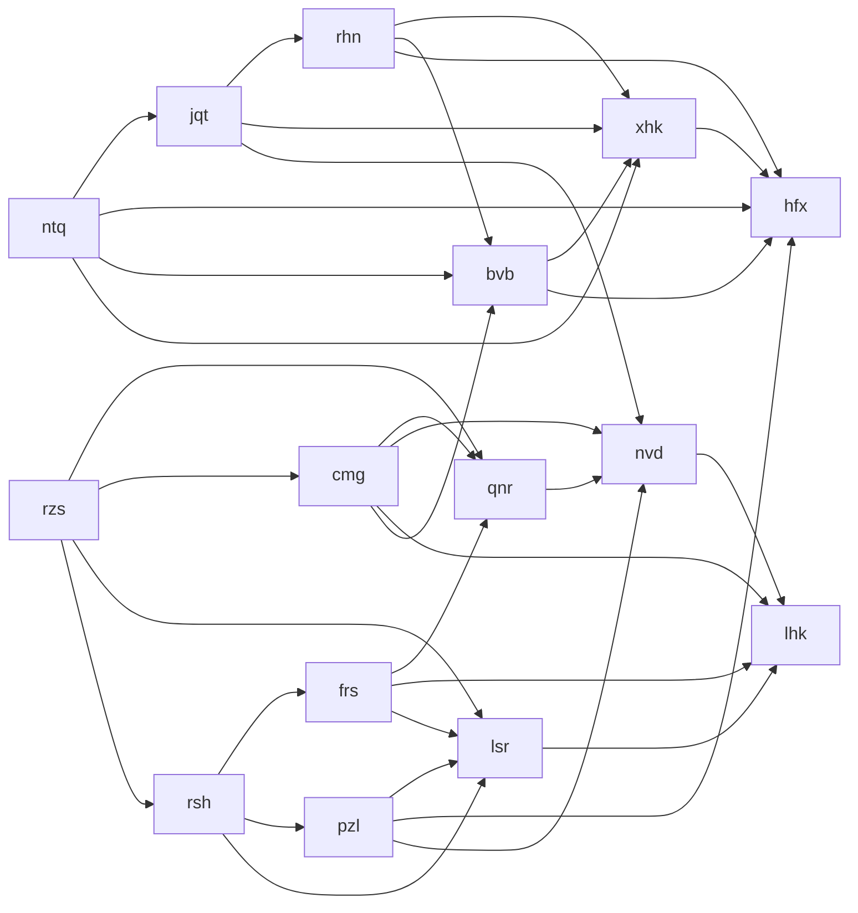
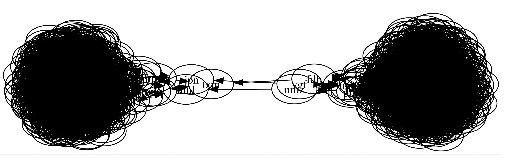

## demo 图

## JUST FOR FUN

根据 input 整理好完整路径[^1]之后，直接作为输入(graph.dot)喂给[graphviz](https://graphviz.org/doc/info/command.html)，然后把 dot 用 [sfdp engine](https://graphviz.org/docs/layouts/sfdp/) 生成 svg，再用 svg 渲染工具[^2]打开:

在图上我们可以清晰的看到题目中所说的**三条连接线**，把三条线断开之后，就得到了我们想要的两个节点集群。

[^1]: 一次简单的kv解析, a: b,c => a->b, a->c
[^2]: 我用的是 InkScape
